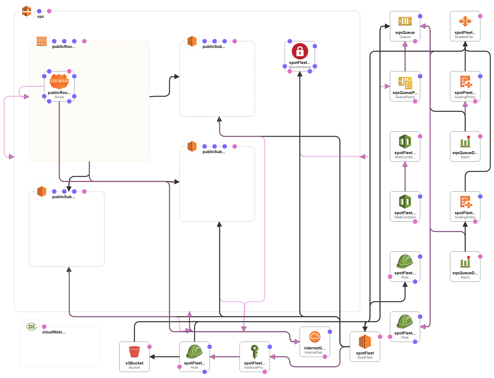

# Running highly available applications at cheapest cost on AWS EC2 Spot fleet with Auto Scaling Group and Load Balancer
---

More and more organizations are now moving their on premise server infrastructure to cloud computing, leveraging the power of AWS and other cloud infrastructure; which provision the whole infrastructure instantly. But the cost saving by this move may not be realized as most of them would be using on-demand instances by default and get charged heavily for AWS EC2 instances, even for non-prod and non-business critical applications.
AWS spot fleet gives the opportunity to run such applications at just a fraction of the cost incurred in running on-demand instances and at the same time ensuring high availability. In summary, we are using below strategy to greatly reduce EC2 cost for our firm, that pays more than $1 million USD per year to AWS:
* Use spot fleet with a mix of instance types and availability zones
* Use spot price of a cent more than the price of on-demand price to reduce chances of auto-termination
* Use auto-scaling-group to ensure high-availability and also auto-terminate unused instances
* Use load-balancer to distribute load among all available instances
* Use scheduled action to terminate instances during week-end hours
* Down-size applications after analyzing them using AWS trusted adviser and Cloud-Watch alerts

I've added most of above features in this [CloudFormation Template](cfn-sqs-ec2-spot-fleet-autoscaling.json) for a spot fleet, that uses auto-scaled instances based on number of SQS messages in the queue. It's spanning across three availability zones. It's configured with different instance types of c5.large and m5a.large, having on demand hourly price of 0.85 and 0.086 respectively in us-east-1 region. I kept the bid price at 0.087 to avoid auto-termination by AWS if spot prices exceeds on-demand price. Current spot price for these instances is 0.035 and 0.034 respectively. As I opted for lowestPrice strategy, creating this stack with single instance picks m5a.large charging me only 0.034 per hour.

Also, cloudwatch agent is added to this, which collects cpu, memory and disk metrices, enableing us to adjust the instance size and type appropriately after monitoring the pattern for some time.

I've also elaborated it further in below blog:

https://medium.com/@deb.manash/running-highly-available-applications-at-cheapest-cost-on-aws-ec2-spot-fleet-with-auto-scaling-916ded70b7f2

Below is the pictorial representation of this implementation:

Please note: My cloud formation template was created referring below AWS provided sample:

https://github.com/awslabs/ec2-spot-labs/blob/master/sqs-ec2-spot-fleet-autoscaling/sqs-ec2-spot-fleet-autoscaling.yaml
